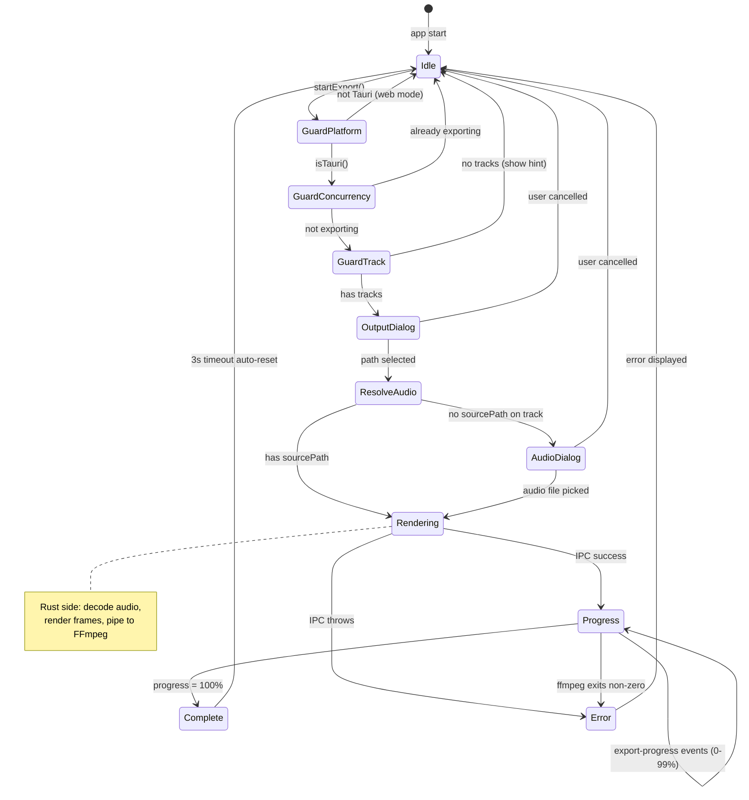

# State Flows

Mermaid diagrams for complex stateful components. Generated from code audit 2026-01-16.

## Export Pipeline

The export flow is the most complex state machine in the app. It involves:

- Multi-step user dialogs (output path, optional audio path)
- IPC to Rust backend
- Progress events via Tauri event system
- Error recovery
- Auto-reset after completion

### Key Files

- `/export/ExportController.ts` - State orchestrator
- `/store/vibeStore.ts` - State storage (isExporting, exportProgress, exportStatus)
- `/src-tauri/src/export_video.rs` - Rust backend

### Race Condition Notes

- `attachProgressListener()` guards against stale events with `if (!isExporting) return`
- Progress listener uses `setTimeout` for auto-reset, checks `exportProgress >= 100` to prevent double-reset

---

## Audio Playback

AudioSystem is a singleton managing Web Audio API state. Has multiple initialization states and reacts to store changes.

### Key Files

- `/engine/AudioSystem.ts` - Singleton class
- `/store/vibeStore.ts` - Reactive state (isPlaying, currentTrackId)
- `/hooks/useVibeEngine.ts` - React adapter

### Store Subscriptions

AudioSystem subscribes to two store slices:

1. `currentTrackId` - triggers `loadTrack()`
2. `isPlaying` - triggers `play()` or `pause()`

---

## Track Loading

Platform-aware track loading with two paths: web (File objects + blob URLs) and Tauri (file paths + convertFileSrc).

### Key Files

- `/hooks/useVibeEngine.ts` - `addTracks()` and `addTracksFromPaths()`
- `/platform/tauriEnv.ts` - Platform detection and Tauri imports
- `/utils.ts` - `getAudioDuration()`, `getAudioDurationFromUrl()`

---

## Store State Map

For completeness, here's the vibeStore state structure (simple, no complex state machine needed):

| Slice                 | Type             | Description                                    |
| --------------------- | ---------------- | ---------------------------------------------- |
| `settings`            | `VibeSettings`   | Persisted to Tauri store, auto-saves on change |
| `playlist`            | `Track[]`        | In-memory track list                           |
| `currentTrackId`      | `string \| null` | Selected track ID                              |
| `isPlaying`           | `boolean`        | Playback state (drives AudioSystem)            |
| `currentTime`         | `number`         | Updated by AudioSystem timeupdate event        |
| `duration`            | `number`         | Updated by AudioSystem durationchange event    |
| `backgroundImage`     | `string \| null` | Object URL for preview                         |
| `backgroundImagePath` | `string \| null` | Absolute path for export (desktop)             |
| `isExporting`         | `boolean`        | Export in progress                             |
| `exportProgress`      | `number`         | 0-100                                          |
| `exportStatus`        | `string`         | Status message                                 |
